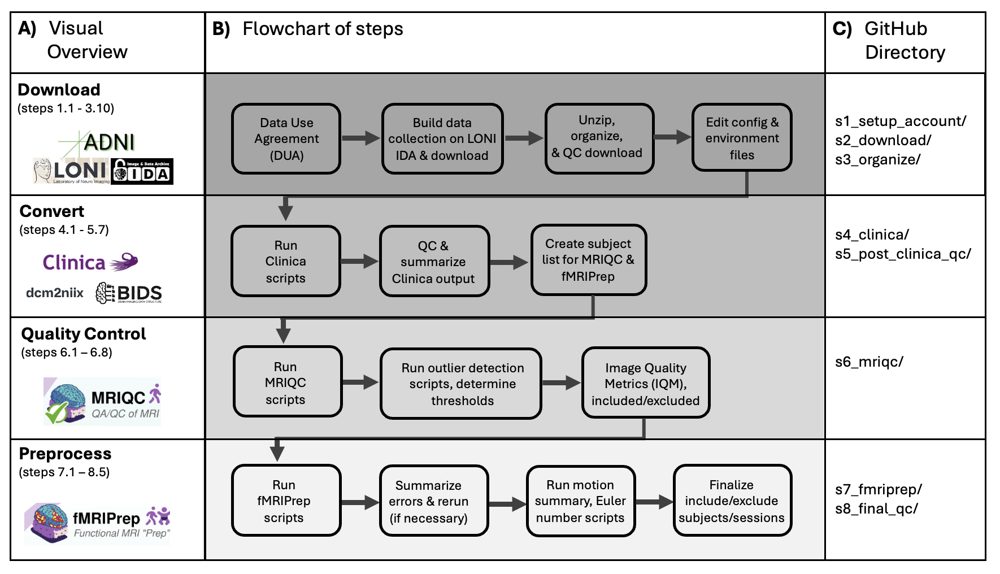

# Alzheimer's Disease Neuroimaging Initiative (ADNI) resting-state functional MRI protocol

This repository contains detailed instructions and code for accessing, downloading, converting DICOMs to NIfTI, BIDs-ifying, running MRIQC + fMRIPrep, and QC-ing the ADNI resting-state fMRI data. 

The output of this protocol is high-quality, pre-processed fMRI data in fs-LR 91k space, ready for downstream analyses.

The repo is organized based on eight steps (described and linked below). Each step has its own directory, with an additional README.md file that contains detailed instructions for that step, including all scripts used. 

We attempted to make this process as automated and reproducible as possible. We document the errors we encountered at every step, provide insight on how we troubleshoot and fix the errors, and describe if any manual intervention is needed. At some steps, like quality checking, there are some decisions that may differ across research groups running this protocol. We attempted to justify and transparently expain all decisions made on inclusion/exclusion based on automated QC metrics (at several steps). We provide tables describing the sample size at every step, including how many subjects/sessions were dropped after a QC decision was made. The hope is that this will allow others to arrive at the same sample size. 

This protocl is for ADNI 2, GO & 3 resting-state fMRI (it also used the T1w and (if available) T2w images for subjects with fMRI). ADNI 1 does not have rs-fMRI and we did not (yet) process ADNI 4 as Clinica (the software we use for converting DCM to NII and BIDs-ifying the data) does not yet handle ADNI 4 data. 

## Step 1.) Account and Access

[s1_setup_account/](https://github.com/saigerutherford/AD_biomarkers/blob/main/s1_setup_account/README.md)

## Step 2.) Build and download image collection

[s2_download/](https://github.com/saigerutherford/AD_biomarkers/blob/main/s2_download/README.md)

## Step 3.) Unzip, organize, and QC download

[s3_organize/](https://github.com/saigerutherford/AD_biomarkers/blob/main/s3_organize/README.md)

## Step 4.) Run Clinica (DCM to NII & BIDS-ify)

[s4_clinica/](https://github.com/saigerutherford/AD_biomarkers/blob/main/s4_clinica/README.md)

## Step 5.) Post-Clinica Quality Control

[s5_post_clinica_qc/](https://github.com/saigerutherford/AD_biomarkers/blob/main/s5_post_clinica/README.md)

## Step 6.) MRIQC

[s6_mriqc/](https://github.com/saigerutherford/AD_biomarkers/blob/main/s6_mriqc/README.md)

## Step 7.) fMRIPrep

[s7_fmriprep/](https://github.com/saigerutherford/AD_biomarkers/blob/main/s7_fmriprep/README.md)

## Step 8.) Final Quality Control

[s8_final_qc/](https://github.com/saigerutherford/AD_biomarkers/blob/main/s8_finalqc/README.md)
