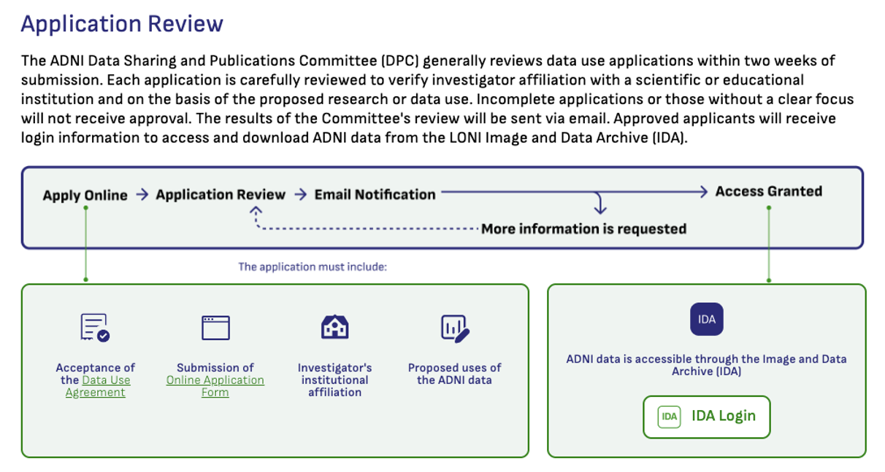

# Step 1.) Account & Access

This step does not use any scripts. We simply point you to the ADNI website, where you can apply for access to the ADNI dataset.

To download the ADNI dataset you first need to register with the [LONI Image & Data Archive (IDA)](https://ida.loni.usc.edu/login.jsp), a secure research data repository, and then request access to the ADNI dataset through the submission of an [online application form](https://ida.loni.usc.edu/collaboration/access/appApply.jsp?project=ADNI).

Once your DUA is approved and your account is active, continue to Step 2 (`s2_download/README.md`) to build and download your image collection via the IDA web UI.
