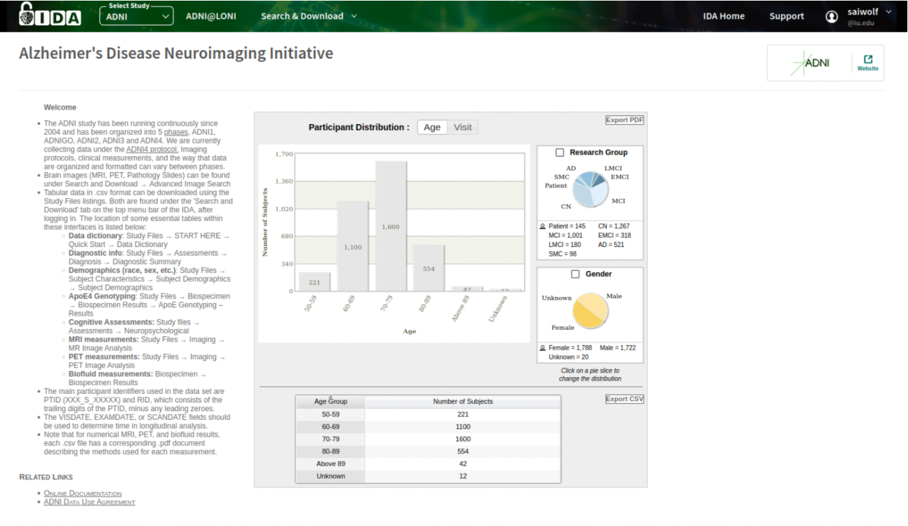

# Step 2.) Build and Download Image Collection.

This step does not require any scripts. Rather, follow the instructions for step 2 in the protocol PDF. All steps are done online via the LONI IDA portal. 

After your DUA has been approved, and you have created an account. You will be able to log in to [LONI IDA](https://ida.loni.usc.edu/login.jsp). This is what the login page looks like. 

Once you are successfully logged in, the home page will look like this. 

2.1.) Click on Search & Download button to see the drop-down menu. 

2.2.) Click on Advanced Image Search

