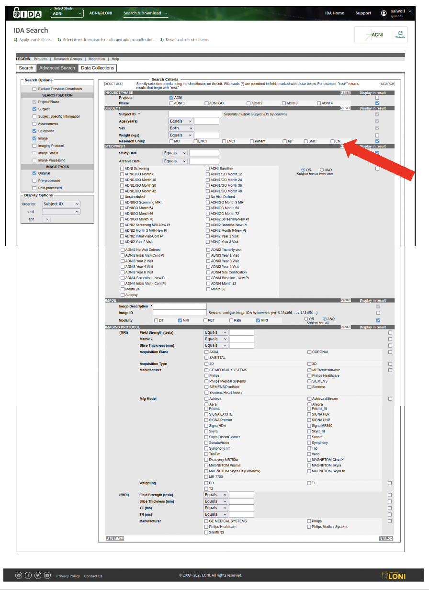
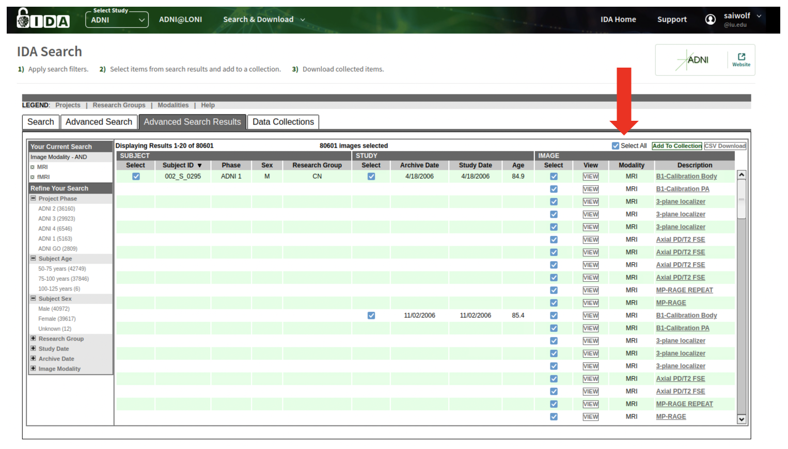
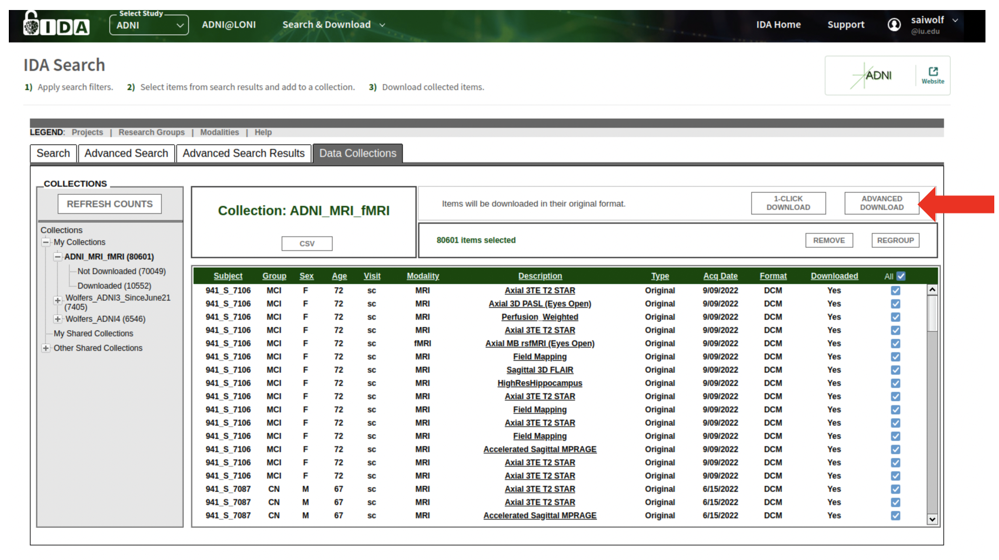
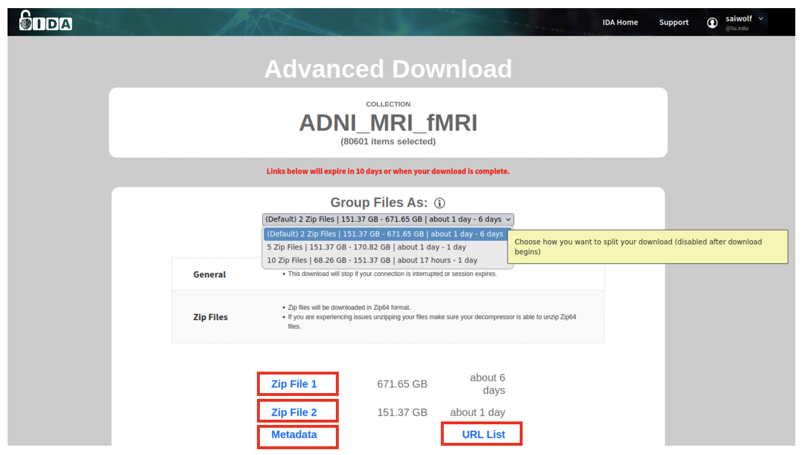
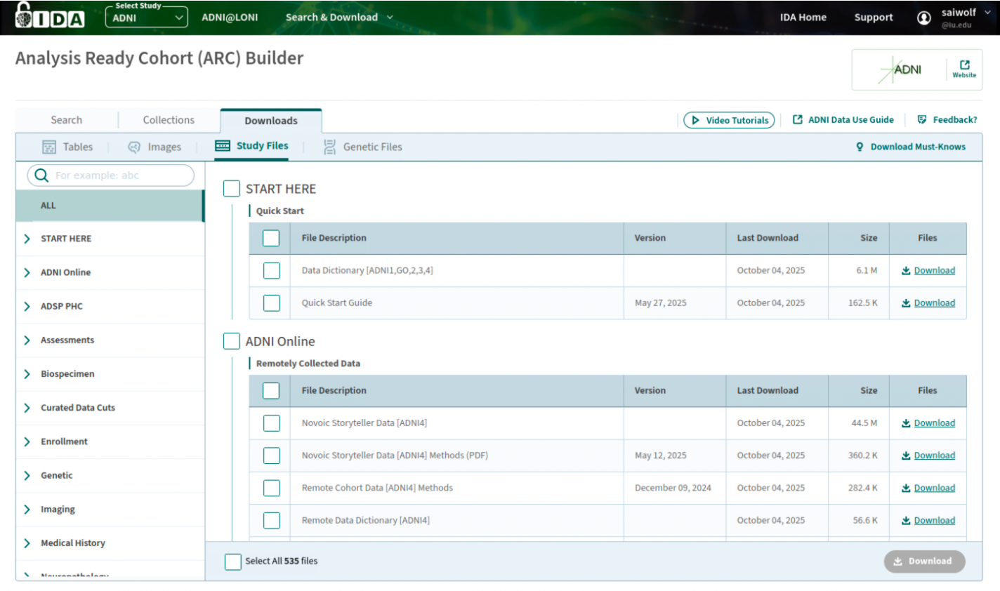
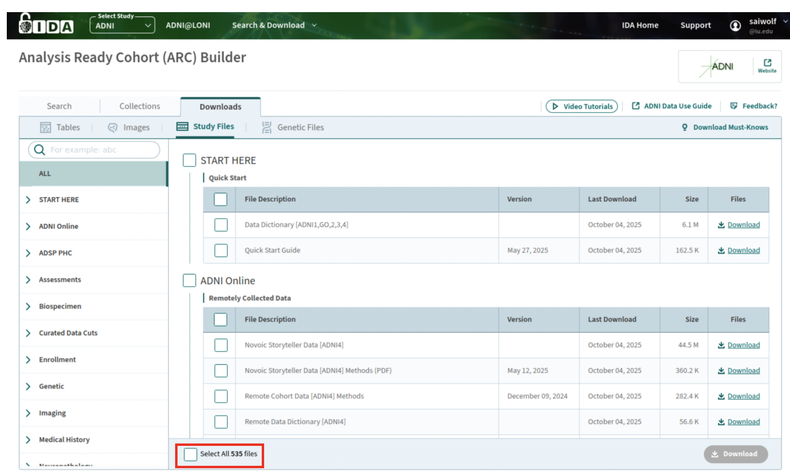
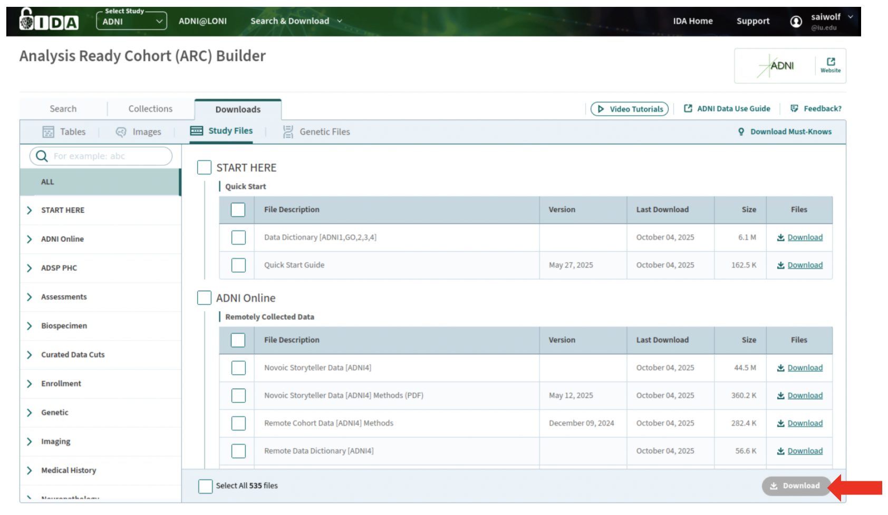

# Step 2.) Build and Download Image Collection.

This step does not require any scripts. Rather, follow the instructions for step 2 in the protocol PDF. All steps are done online via the LONI IDA portal. 

After your DUA has been approved, and you have created an account. You will be able to log in to [LONI IDA](https://ida.loni.usc.edu/login.jsp). This is what the login page looks like. 

Once you are successfully logged in, the home page will look like this. 

**2.1.)** Click on Search & Download button to see the drop-down menu. 

**2.2.)** Click on Advanced Image Search.

**2.3)** This is the page for selecting which subjects to include in your image collection. If you use a row to filter the data, be sure to click ‘Display in result’ for that row so that information is in your collection (e.g., which ADNI study, which imaging modality, clinical group or control).

**2.4.)** Filter here on which ADNI studies to include in your collection.

**2.5.)** Filter here on which clinical/control groups (AD, MCI, CN).

**2.6)** Filter here on study date and archive date (leave blank if you want all data from beginning of study to present day).

**2.7.)** Filter here on which imaging modalities (e.g. , MRI & fMRI) to include. You can choose OR/AND. OR will select subjects that have MRI and/or fMRI. AND will only include subjects that have both MRI & fMRI. 

**2.8.)** Once you have made all of the decisions on what data to include in your collection, click on Search.

**2.9.)** Now you are on the Advanced Search Results page, based on the criteria you selected (e.g., MRI and fMRI for all ADNI subjects).

**2.10.)** First, click on Select All.

**2.11.)** Then click on Add to Collection

**2.12.)** Give your Collection a name and description. 

**2.13.)** Click OK to save. 

**2.14.)** You should now be in the Data Collections tab. You can move back and forth between the search criteria and results by clicking on these tabs.

**2.15.)** Click on the CSV button bellow the collection name. This will download the CSV file showing all of the criteria you used to build the collection (useful for verifying the download).

**2.16.)** Click on ‘All’ to select all of the data from your collection to download. 

**2.17.)** Then click on Advanced Download. 

**2.18.)** A new browser tab or window should open, displaying a page similar to this with your download links.

**2.19.)** You can click on the drop-down menu (under the Group Files As) , and it will show different ways to group the downloads. We advise you to group files as 10 zip files. 

**2.20.)** Click on the Zip File 1, etc. links, and the download should start.

**2.21.)** Click on the Metadata and URL List links to download the associated filenames CSVs and metadata.

**2.22.)** You must also download the Study files (behavioral, clinical, demographics, study information/notes, etc.). Again, click on the Search & Download button again, and a drop-down menu will show. Click on Study Files.

**2.23.)** Use this page to select which files you want to download. 

**2.24.)** You can also select all files (535 files, 290 GB). If you de-select ‘Biospecimen’ and ’Test Data’ after selecting all, then the download is only 2.0 GB (308 files).

**2.25.)** Once you have made your selection, click on download at the bottom of the page. The download should start immediately. 

