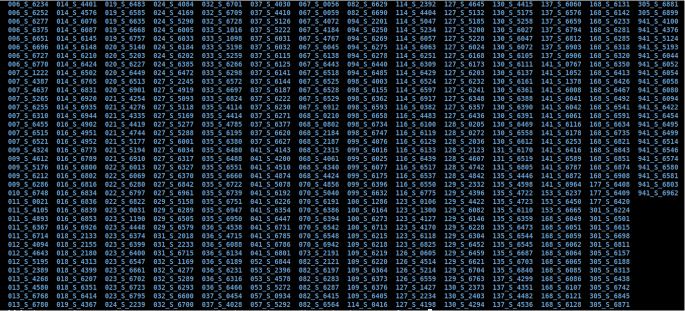
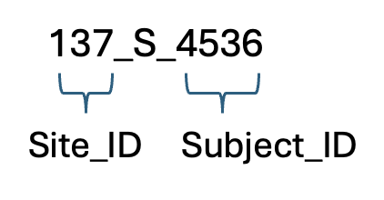
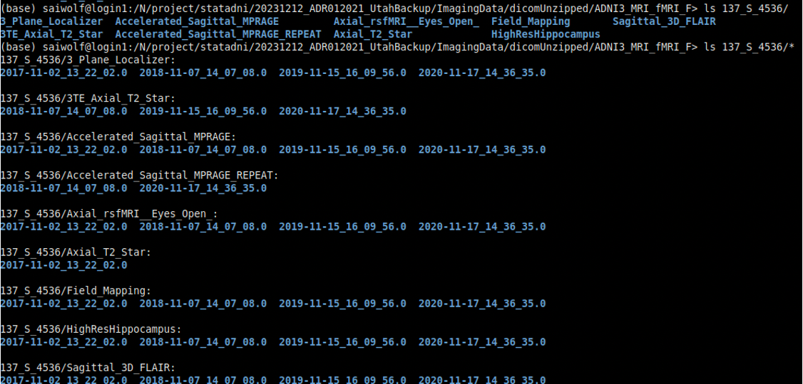

# Step 3: Unzip, organize, and QC download.

**3.1.)** First, move all downloaded files (.zip, .csv, .tar.gz) from your downloads/ directory into a new directory where you would like to store the study data. We will refer to this directory as `ADNI_data/`, but you can name it whatever you choose. 

```mv ADNI_image_filename*.tar.gz /path/to/ADNI_data/```

```mv ADNI_meta_data.zip /path/to/ADNI_data/```

```mv ADNI_URL.csv /path/to/ADNI_data/```

```mv ADNI_image_collection_name_date.csv /path/to/ADNI_data/```

```mv ADNI_behavioral_data.zip /path/to/ADNI_data/```

**3.2.)** Verify that all files are present. Depending on how many files you chose (in step 2.19) during the download of the imaging data (e.g., 10), you should have 10 imaging zip files, a metadata zip file, the URL list CSV file, a CSV file describing the variables used in creating the imaging collection (from step 2.15), and a zipped file of the behavioral data.

```ls /path/to/ADNI_data/```

**3.3.)** Create sub-directories to store: a) imaging data, b) metadata, c) scripts, d) behavioral data. Move the zip & CSV files into the correct sub-directories.

```mkdir image_data meta_data scripts beh_data```

```mv ADNI_image_filename*.tar.gz image_data/```

```mv ADNI_meta_data.zip meta_data/```

```mv ADNI_URL.csv meta_data/```

```mv ADNI_image_collection_name_date.csv scripts/```

```mv ADNI_behavioral_data.zip beh_data/```


**3.4.)** Unzip the imaging and behavioral data files. The behavioral zip file will unzip multiple CSV files, as well as the ADNIMERGE file and directory. The imaging zip files will take quite a bit of time to unzip as there are many DICOM files. 

```cd beh_data/```

```unzip ADNI_behavioral_data.zip```

```cd ../image_data/```

```for i in *.zip; do unzip ${i}; done```


**3.5.)** After the imaging files have all been unzipped, there should be many subject directories. 

<div>

</div>

**3.6.)** Subject IDs all have the following format:

<div>

</div>

**3.7.)** Within each subject directory (e.g., 137_S_4536/) there is a sub-directory for each imaging modality (e.g., Accelerated_Sagittal_MPRAGE/, Axial_rsfMRI__Eyes_Open/). Within each imaging modality directory, there is a sub-directory for each scan date (e.g., 2017-11-02_13_22_02.0/, 2018-11-07_14_07_08.0/, 2019-11-12_16_09_56.0/, 2020-11-17_14_36_35.0/) and within each scan date directory there is an additional directory. Here is an example full path to the DICOMs: `137_S_4536/Accelerated_Sagittal_MPRAGE/2017-11-02_13_22_02.0/S627332/`.

<div>

</div>

**3.8.)** Run `create_dicom_dirs_csv.sh`. This script will loop through all of the dicom directories and write a CSV file. We will use this CSV file to confirm that all of the downloaded files are present (compare it to the LONI IDA dicom CSV).


**3.9.)** Use the python notebook `dicom_qc.ipynb` to compare the unzipped dicom directories with the image collection download list from ADNI. You can also use this notebook to isolate the necessary modalities for preprocessing (T1w, T2w, resting-state fMRI). The names of the dicom folders are inconsistent, so this notebook contains the dictionary for mapping the names of T1w, T2w, and rs-fMRI names across subjects and sessions. 


**3.10.)** Once you have finalized the list of dicom directories, you can then use this notebook to create the list of subjects to pass onto the next step where we convert to NIFTI and BIDS-ify the data using Clinica. The subject list should be saved as a text file. 
