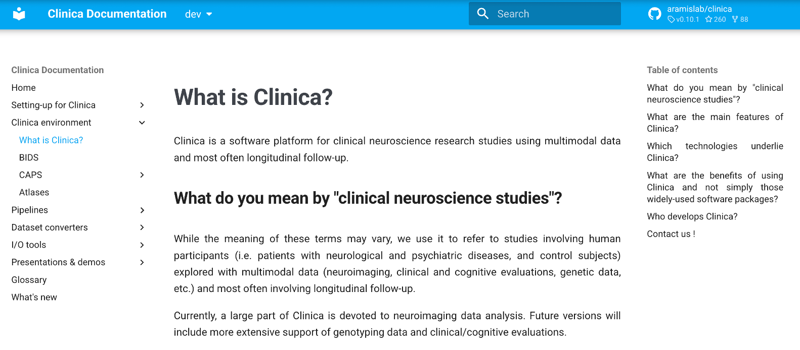

# Step 4.) Running Clinica

**4.1.)** We will use [Clinica](https://aramislab.paris.inria.fr/clinica/docs/public/dev/Converters/ADNI2BIDS/) to convert the DICOMs to NIFTI format and to organize the data following the BIDS format (Brain Imaging Data Structure). Below is the homepage of the Clinica software’s website.  
<div>

</div>

**4.2.)** Clinica requires users to download and install the [dcm2nix](https://github.com/rordenlab/dcm2niix) software. You can instill it via conda.

```conda install –c conda-forge dcm2niix```


**4.3.)** Use conda to create and activate a virtual environment. 

```module load conda; conda create –n clinica_env; conda activate clinica_env;```


**4.4)** Use pip to install the Clinica Python package. 

```pip install clinica```


**4.5.)** Use the subject list you created in step 3.10 to create subject-specific Clinica scripts (faster than running on everyone at once). We run Clinica on individual subjects (in parallel) because this significantly speeds up the process. The script for creating individual Clinica scripts can be found at: `create_slurm_script_per_sub.sh`.


**4.6.)** Use the script `adni_submit_slurm.sh` to submit all subjects to SLURM to run in parallel. This script can be adjusted to run on different HPC systems. If not running this on an HPC (i.e., a personal computer (not recommended)), this script can be skipped, and the individual Clinical scripts can be run as many in parallel as your computer allows for. 


**4.7.)** Once all Clinica jobs finish running, we need to merge the individual BIDS folders into the same directory. This can be done using the script `merge_individual_clinica.sh`. 

Now, continue on to [Step 5.](https://github.com/saigerutherford/AD_biomarkers/blob/main/s5_post_clinica_qc/README.md)
